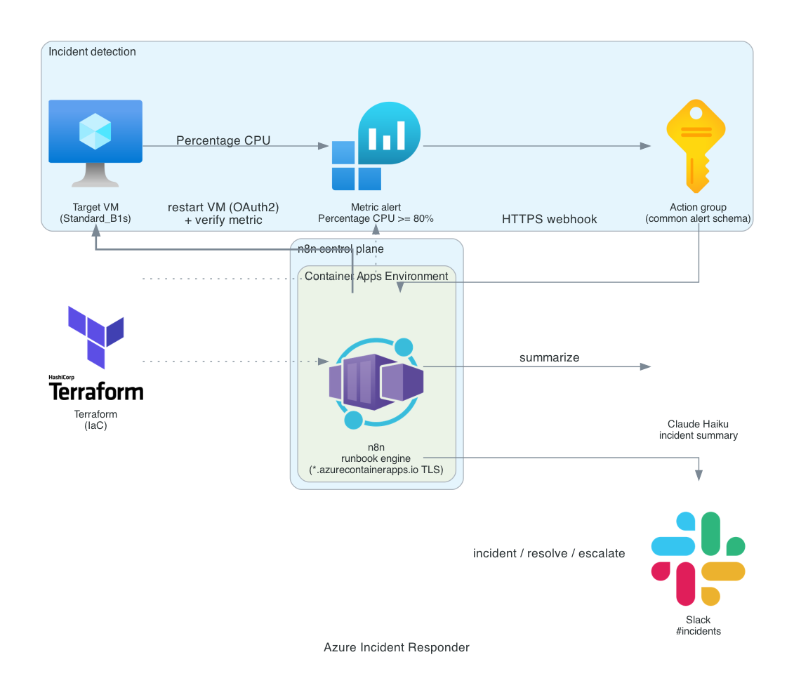

# Azure Incident Responder

The Azure counterpart to [aws-incident-responder](https://github.com/jordann6/aws-incident-responder). An automated incident response pipeline where the runbook is an n8n workflow rather than glue code. An Azure Monitor metric alert on a target VM fires through an action group webhook into n8n running on Azure Container Apps. The workflow asks Claude Haiku for a plain-English incident summary, posts an incident card to Slack, restarts the VM through the Azure Management API, then re-checks the CPU metric to decide whether to mark the incident resolved or escalate.

## Architecture



## How it works

```
Target VM  Percentage CPU >= 80% (5 min)
  -> Azure Monitor metric alert
    -> Action group (common alert schema webhook)
      -> n8n on Azure Container Apps (managed HTTPS FQDN)

n8n runbook:
  parse common alert schema
  -> Claude Haiku incident summary
  -> Slack incident card
  -> restart VM (Azure Management API, OAuth2 client credentials)
  -> wait 90s
  -> query Percentage CPU metric
  -> resolved  -> Slack resolved
     still high -> Slack escalate
```

## Why this is different from the AWS build

The two projects are deliberately built on different toolchains to show cross-cloud range, the same way [aws-developer-platform](https://github.com/jordann6/aws-developer-platform) and [azure-developer-platform](https://github.com/jordann6/azure-developer-platform) differ:

| Concern | AWS build | Azure build |
|---|---|---|
| Detection | CloudWatch alarm | Azure Monitor metric alert |
| Delivery | SNS HTTPS subscription (with confirmation handshake) | Action group webhook (direct, common alert schema) |
| TLS endpoint | ALB + ACM cert + Route 53 subdomain | Container Apps managed FQDN, valid cert out of the box |
| n8n hosting | ECS Fargate behind an ALB | Azure Container Apps |
| Remediation auth | Scoped IAM user + SigV4 | Entra service principal + OAuth2 client credentials |
| Remediation action | `RebootInstances`, verify with DescribeAlarms | VM `restart`, verify with the Percentage CPU metric |

Both keep the same shape: a visual, version-controlled runbook and a Claude Haiku summary so the Slack card reads like an on-call note.

## Components

| Layer | Resource | Role |
|---|---|---|
| Detection | **VM target** (Standard_B1s, Ubuntu 22.04) | Demo workload; CPU is driven for the demo with `az vm run-command` |
| Detection | **Metric alert** | `Percentage CPU >= 80%` over a 5-minute window, evaluated every minute |
| Routing | **Action group** | Posts the common alert schema to the n8n webhook |
| Control plane | **Container Apps** | Runs `n8nio/n8n`, the runbook engine, on a managed HTTPS FQDN |
| Runbook | **Claude Haiku** | Generates the incident summary and recommended next step |
| Runbook | **Slack** | Incident, resolved, and escalation messages to `#incidents` |
| Remediation | **Service principal** | `Virtual Machine Contributor` scoped to the target VM only |
| IaC | **Terraform** | RG, VNet, VM, Container Apps, alert, action group; azurerm remote state |

## Prerequisites

- Terraform >= 1.6, Azure CLI logged in to subscription `9c644a73-5dc1-4bfe-9e90-91865014cdd2`
- The azurerm state backend (`rg-tfbackend-jordprojs` / `sttfbejordprojs8557` / `tfstate`)
- An Anthropic API key and a Slack bot token with `chat:write`

## Deploy

n8n secrets are generated by Terraform (`random_password`) and live only in the private state backend, so there is no pre-step:

```bash
cd terraform
terraform init
terraform apply
```

Note the outputs (`n8n_url`, `n8n_webhook_endpoint`, `target_vm_id`, `target_vm_name`, `alert_name`). Retrieve the n8n password:

```bash
terraform output -raw n8n_basic_auth_password
```

### Create the scoped service principal

n8n restarts the VM under a least-privilege identity, created out of band so no secret enters Terraform state:

```bash
az ad sp create-for-rbac \
  --name "incident-responder-n8n" \
  --role "Virtual Machine Contributor" \
  --scopes "$(terraform output -raw target_vm_id)"
```

### Configure n8n

1. Open `n8n_url`, log in with `admin` and the password above.
2. Import `workflows/incident-responder-azure.json`.
3. Add the Azure credential as **OAuth2 (client credentials)**:
   - Access Token URL: `https://login.microsoftonline.com/<tenant-id>/oauth2/v2.0/token`
   - Client ID / Secret: from the `az ad sp` output (`appId` / `password`)
   - Scope: `https://management.azure.com/.default`
4. Add the Anthropic credential as HTTP Header Auth: header `x-api-key`, value = your API key.
5. Add the Slack credential (bot token) and confirm the bot is in `#incidents`.
6. Activate the workflow. The action group already points at the webhook, so no extra wiring is needed.

## Validate

Drive CPU on the target so the alert fires:

```bash
az vm run-command invoke \
  --name "$(terraform output -raw target_vm_name)" \
  --resource-group rg-incident-responder \
  --command-id RunShellScript \
  --scripts "sudo apt-get update -y && sudo apt-get install -y stress-ng && stress-ng --cpu 0 --timeout 600s"
```

Within the alert window the metric alert fires and the runbook runs end to end. Confirm:

- Slack `#incidents` shows the incident card with the Haiku summary, then a resolved or escalation message.
- The n8n execution log shows the full path including the restart and metric query.
- The VM shows a recent restart in the Azure portal activity log.

## Destroy

```bash
cd terraform
terraform destroy
az ad sp delete --id "$(az ad sp list --display-name incident-responder-n8n --query '[0].appId' -o tsv)"
```

Teardown is clean: a single resource group holds everything Terraform creates, and the service principal is removed separately.

## Cost

About `$0.05/hour` while running (one 0.5 vCPU Container App, one Standard_B1s VM, Log Analytics ingestion), roughly `$1/day`. Built to deploy, demo, and destroy the same day for well under a dollar.

## Hardening notes

- In production the Container App would use a managed identity with a federated credential instead of a service principal secret, removing the long-lived client secret.
- n8n runs on SQLite on the Container App's ephemeral storage. For persistence across revisions, attach Azure Files or point n8n at a managed Postgres.
- A production runbook would add an approval gate before the restart and a maximum retry budget before escalation.
